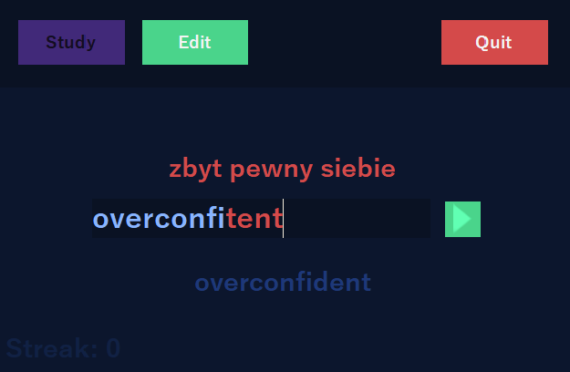
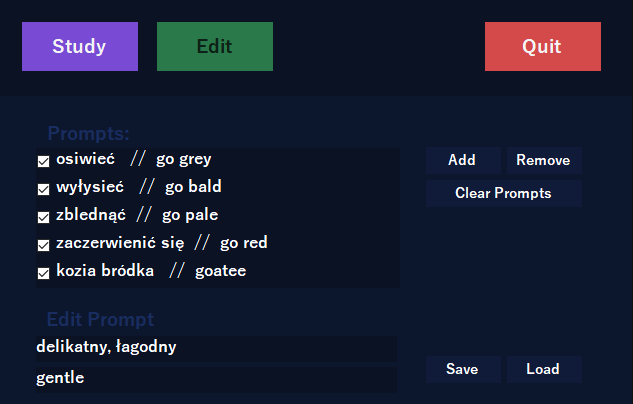

# StudyKit-forms
Studying Tool Made For Memorizing Words
<br>
Made in C# Winforms
<br>
[](https://choosealicense.com/licenses/mit/)

## Features
* Prompt System
* Save/Load via Json
* Checking for errors
* Drag & Drop
* Whitespace proof environment



## Editing Prompts
The Prompt Files Are Saved As JSON & Can Be Directly Edited
```json
[
   {
      "promptText":"praca",
      "correctAnswer":"die arbeit",
      "checkState":1
   },
]
```
They Can Also Be Edited via The GUI
<br>

